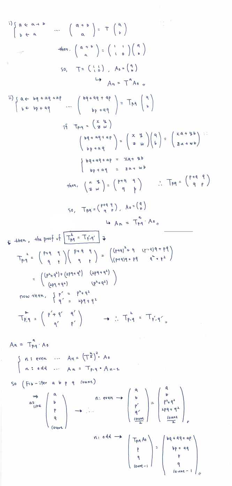

.. comment

   SICP Chapter1
   Exercise 1.19

解法
-----

.. comment

   TODO: Tex に変換

.. sourcecode:: scheme

   (define (Fib n)
       (Fib-iter 1 0 0 1 n))
 
   (define (Fib-iter a b p q count)
       (cond
           ((= count 0) b)
           ((even? count) 
             (Fib-iter a b (+ (* p p) (* q q)) (+ (* 2 p q) (* q q)) (/ count 2)))
           (else
             (Fib-iter (+ (* b q) (* a q) (* a p)) (+ (* b p) (* a q)) p q (- count 1)))))
